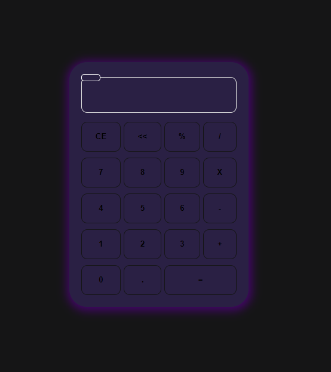
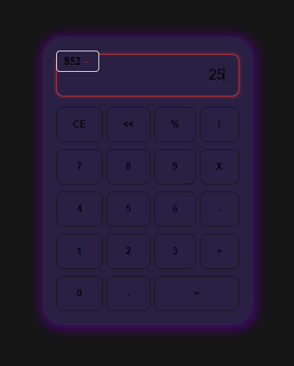

<h1> HTML-JS-vanilla-Simples-Calculadora </h1>

	<figure style="width: 100px; min-height: 50px; float: left;">
		
	</figure>
	<figure style="width: 100px; min-height: 100px; float: right;">
		
	</figure>
	
	<h4>Uma simples calculadora feita em HTML + JS Vanilla + CSS,   apenas como demonstração para o meu portfólio de JS simples</h4>

<h4 align="center"> 
	🚧  Funcionalidades ainda em construção...  🚧
</h4>

- [x] Calculos funcionais
- [x] Calculo de porcentagens
- [ ] Modo troca de temas
- [x] Modo de minificação
